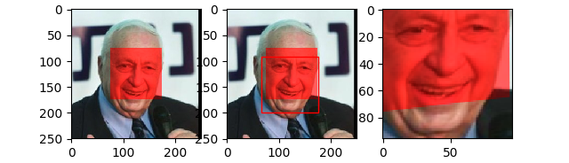

# FaceRecognitionATK
- For original author's code, see [this](https://github.com/krasserm/face-recognition).

## Setup
### Environment
* Python 3.8
* MacOS or Linux

### Steps
* Recommend setting up a virtual environment. (Old version of Keras & Tensorflow to install.)
```bash
pip install virtualenv

virtualenv FaceRecognition

source ./FaceRecognition/bin/activate
```
* Install packages in **requirements.txt**.
```bash
pip install -r requirements.txt
```
## Usage-Circle
### Positional & Optional Parameters
* **data**: Image dir path, e.g. './data/humanface'
* **n**: Image index to attack.
* **-i**: Added signals intensity. R(red) channel/Pink. Automatically cropped to 0-255.
* **-r**: Decay ratio. B(blue) & G(green) channels. (0.0~1.0)
* **-x**: Circle center in x axis.
* **-y**: Circle center in y axis.
* **-d**: Radius of the circle.
* **-t**: Type of perturbation: 'Gaussian' or 'Flaptop'. Guassian for gaussian distribution. Flaptop for consistent values in all pixels.
* **-hs**: Color type: 'red' or 'white'. 'red' for only intensity in R channel. 'white' for adding pink (255, 105, 180) color as shown in photos, white in the middle when -t=='Gaussian'.

### Example
```bash
python util_c.py './data/humanface' 9 -i 200 -r 1.0 -x 125 -y 125 -d 20 -t 'Gaussian' -hs 'white'
```
For this example, you are running an attack with:
* Attacking the tenth image. (n=9)
* Place a pink cicle at coordinate \[125, 125] (middle) with a radius of 20.
* Intensity of perturbation follows Gaussian Distribution. The peak value is 200.
* -r==1.0 No decay in GB channels.


```bash
python util_c.py './data/humanface' 10 -i 100 -r 0.4 -x 80 -y 200 -d 30 -t 'Flaptop' -hs 'red'
```
For this example, you are running an attack with:
* Attacking the eleventh image. (n=10)
* Place a pure red cicle at coordinate \[80, 200] with a radius of 30.
* Intensity of perturbation follows Even Distribution. The value is 100.
* -r==0.4 Decay rate in GB channels.


## Usage-Square
### Positional & Optional Parameters
* **data**: Image dir path, e.g. './data/humanface'
* **n**: Image index to attack.
* **-i, --inten**: Added signals intensity. R(red) channel. Automatically cropped to 0-255.
* **-r, --ratio**: Decay ratio. B(blue) & G(green) channels. (0.0~1.0)
* **-a**: Starting polluting pixel in x axis (top-left).
* **-b**: Ending polluting pixel in x axis (bottom-left).
* **-c**: Starting polluting pixel in y axis (top-right).
* **-d**: Ending polluting pixel in y axis (bottom-right).

### Example
```bash
python util.py './data/humanface' 9 -i 60 -r 0.4 -a 75 -b 175 -c 75 -d 175
```
For this example, you are running an attack with:
* Attacking the tenth image. (n=9)
* Place a 100\*100 Pattern position in the middle. (\[-a,-b,-c,-d]=\[75,175,75,175] in a 250\*250 image)
* R adds 60. (-i=60)
* GB decay to 40%. (-r=0.4)



To compare with correct alignment without attack, you can run with benign parameter set or simply pass no optional parameters.
```bash
python util.py './data/humanface' 9 -i 0 -r 1.0 -a 0 -b 0 -c 0 -d 0
```
or
```bash
python util.py './data/humanface' 9
```

### Comments
- Images in **data/humanface** are all 250\*250. You can apply to new images (.jpg/ .jpeg) at any time. But pay attention to pattern position in different image sizes.
- If the program returns None and raises an error, this means alignment fails (attack succeeds).
- For very big images (e.g. 2000\*1500), better crop to proper size first.
- For irregular pattern shape (e.g. circles), edit it [here](https://github.com/liuzey/FaceRecognitionATK/blob/762058053c6b2c42c6100410924bc5c1a41da809/contaminate.py#L25).

## Reference
* Afifi M, Brown M S. [What else can fool deep learning? Addressing color constancy errors on deep neural network performance](https://openaccess.thecvf.com/content_ICCV_2019/papers/Afifi_What_Else_Can_Fool_Deep_Learning_Addressing_Color_Constancy_Errors_ICCV_2019_paper.pdf). ICCV. 2019: 243-252.
* Afifi M, Brown M S. [Deep White-Balance Editing](https://openaccess.thecvf.com/content_CVPR_2020/papers/Afifi_Deep_White-Balance_Editing_CVPR_2020_paper.pdf). CVPR. 2020: 1397-1406.
* Zhou Z, Tang D, Wang X, et al. [Invisible mask: Practical attacks on face recognition with infrared](https://arxiv.org/pdf/1803.04683.pdf). arXiv preprint arXiv:1803.04683, 2018.
* Nguyen D L, Arora S S, Wu Y, et al. [Adversarial Light Projection Attacks on Face Recognition Systems: A Feasibility Study](https://openaccess.thecvf.com/content_CVPRW_2020/papers/w48/Nguyen_Adversarial_Light_Projection_Attacks_on_Face_Recognition_Systems_A_Feasibility_CVPRW_2020_paper.pdf). CVPR. 2020: 814-815.
* Man Y, Li M, Gerdes R. [GhostImage: Remote Perception Attacks against Camera-based Image Classification Systems](https://arxiv.org/pdf/2001.07792.pdf). RAID. 2020: 317-332.
* Selvaraj J, Dayanıklı G Y, Gaunkar N P, et al. [Electromagnetic induction attacks against embedded systems](https://dl.acm.org/doi/abs/10.1145/3196494.3196556). AsiaCCS. 2018: 499-510.
* Sugawara T, Cyr B, Rampazzi S, et al. [Light commands: laser-based audio injection attacks on voice-controllable systems](https://www.usenix.org/system/files/sec20-sugawara.pdf). USNEIX. 2020: 2631-2648.
* Shin H, Kim D, Kwon Y, et al. [Illusion and dazzle: Adversarial optical channel exploits against lidars for automotive applications](https://link.springer.com/chapter/10.1007/978-3-319-66787-4_22). CHES. Springer, Cham, 2017: 445-467.
* Petit J, Stottelaar B, Feiri M, et al. [Remote attacks on automated vehicles sensors: Experiments on camera and lidar](https://www.blackhat.com/docs/eu-15/materials/eu-15-Petit-Self-Driving-And-Connected-Cars-Fooling-Sensors-And-Tracking-Drivers-wp1.pdf). Black Hat Europe, 2015, 11: 2015.
* Cao Y, Xiao C, Cyr B, et al. [Adversarial sensor attack on lidar-based perception in autonomous driving](https://arxiv.org/pdf/1907.06826.pdf). Proceedings of the 2019 ACM SIGSAC Conference on Computer and Communications Security. 2019: 2267-2281.
* Yan C, Shin H, Bolton C, et al. [SoK: A Minimalist Approach to Formalizing Analog Sensor Security](http://www.connorbolton.com/papers/oakland2020-SoK.pdf). 2020 IEEE Symposium on Security and Privacy (SP). 2020: 480-495.
* Giechaskiel I, Rasmussen K. [Taxonomy and challenges of out-of-band signal injection attacks and defenses](https://ieeexplore.ieee.org/iel7/9739/5451756/08896847.pdf?casa_token=szxecPE70gEAAAAA:VvJLh7KJ08wWBKoX-boFkkhGEYWJEsWmgHVAiuN3-H6bSWHhn0bSCqXQlYpLIXvSyYZIfilTlRk). IEEE Communications Surveys & Tutorials, 2019, 22(1): 645-670.
* Truong K N, Patel S N, Summet J W, et al. [Preventing camera recording by designing a capture-resistant environment](http://www.rageuniversity.org/PRISONESCAPE/CCTV%20SURVEILLANCE%20PRISONS/neutralising%20cameras%20with%20pulsed%20flash.pdf). International conference on ubiquitous computing. Springer, Berlin, Heidelberg, 2005: 73-86.
* Eykholt K, Evtimov I, Fernandes E, et al. [Robust physical-world attacks on deep learning visual classification](https://openaccess.thecvf.com/content_cvpr_2018/papers/Eykholt_Robust_Physical-World_Attacks_CVPR_2018_paper.pdf). Proceedings of the IEEE Conference on Computer Vision and Pattern Recognition. 2018: 1625-1634.
* Sharif M, Bhagavatula S, Bauer L, et al. [Accessorize to a crime: Real and stealthy attacks on state-of-the-art face recognition](https://dl.acm.org/doi/pdf/10.1145/2976749.2978392?casa_token=i5WILqa5WdAAAAAA:Rr_wzEoPOdN0cd9lykedU065kowyXOuFiYnhERBs5B3sKJwf9ATr8V4MLyh9VQkyktrKD_Q4CzMiWg). Proceedings of the 2016 acm sigsac conference on computer and communications security. 2016: 1528-1540.
* Zhao Y, Zhu H, Liang R, et al. [Seeing isn't Believing: Towards More Robust Adversarial Attack Against Real World Object Detectors](https://dl.acm.org/doi/pdf/10.1145/3319535.3354259?casa_token=V_cJirt_ZtsAAAAA:VlJWXSqFBDcsY8-WBdqf4Wp5bpAv_H0ioVsfnP1iKS2F2QpJ8gpCZ8p1pSv6oBv_R-SqIEvJfT9vUQ). Proceedings of the 2019 ACM SIGSAC Conference on Computer and Communications Security. 2019: 1989-2004.
* Li J, Schmidt F R, Kolter J Z. [Adversarial camera stickers: A physical camera-based attack on deep learning systems](https://arxiv.org/pdf/1904.00759). arXiv preprint arXiv:1904.00759, 2019.
* Nassi B, Nassi D, Ben-Netanel R, et al. [Phantom of the ADAS: Phantom Attacks on Driver-Assistance Systems](https://pdfs.semanticscholar.org/0842/8fb2ce2732afbc9d91a63359cc603a25602a.pdf). IACR Cryptol. ePrint Arch., 2020, 2020: 85.
* Shoukry Y, Martin P, Tabuada P, et al. [Non-invasive spoofing attacks for anti-lock braking systems](https://eprint.iacr.org/2015/419.pdf). International Conference on Cryptographic Hardware and Embedded Systems. Springer, Berlin, Heidelberg, 2013: 55-72.
* Chernikova A, Oprea A, Nita-Rotaru C, et al. [Are self-driving cars secure? Evasion attacks against deep neural networks for steering angle prediction](https://ieeexplore.ieee.org/iel7/8834415/8844588/08844593.pdf?casa_token=8CxUaI_lVpMAAAAA:YyU9w0k1IYGCbO1LAj2rsWkbQG3dVdq4pVZ9bnPfJwNXd6ifL8HyAPKIQEnOCnbYotYgx6R3U2k). 2019 IEEE Security and Privacy Workshops (SPW). IEEE, 2019: 132-137.
* Tu J, Ren M, Manivasagam S, et al. [Physically Realizable Adversarial Examples for LiDAR Object Detection](http://openaccess.thecvf.com/content_CVPR_2020/papers/Tu_Physically_Realizable_Adversarial_Examples_for_LiDAR_Object_Detection_CVPR_2020_paper.pdf). Proceedings of the IEEE/CVF Conference on Computer Vision and Pattern Recognition. 2020: 13716-13725.

## Schedule
- [x] Theoretical attack for face alignments.
  - [x] Exposure or White-Balance.
  - [x] Cheating with T-shirts.
- [ ] Theoretical models for lens tolerance and adjustment.
- [ ] Real parameter acquisition and evasion attack implementation.
- [ ] Theoretical attacks for face recognition (misidentification).
- [ ] Real face recognition attacks.
